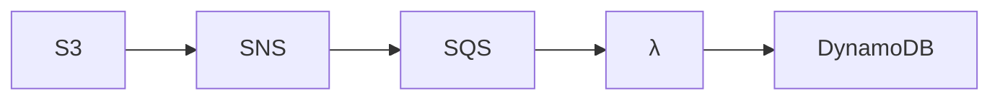

# Übung 124

## Debuggen

Lade dir den Code der heutigen Vorlesung runter.

<https://github.com/MTeeeee/teaching/tree/main/terraform/debug_s3_sns_sqs_dynamodb>

Der angedachte Workflow ist:

Wenn ein Objekt in den S3 geladen wird, soll am Ende ein Eintrag in die DynamoDB gemacht werden. (Am besten mit dem Dateinamen) Der Terraformcode ist aktuell fehlerhaft und das gewünschte Ergebnis wird nicht erreicht.

### Aufgabe

Schildere in eigenen Worten, wie man vorgehen kann, um den Fehler zu finden. An welchen Stellen
könnte der Fehler sein und wie könnte man dies Überprüfen.

### Freiwillig

Korrigiere den Code und lade es in dein Repo.
