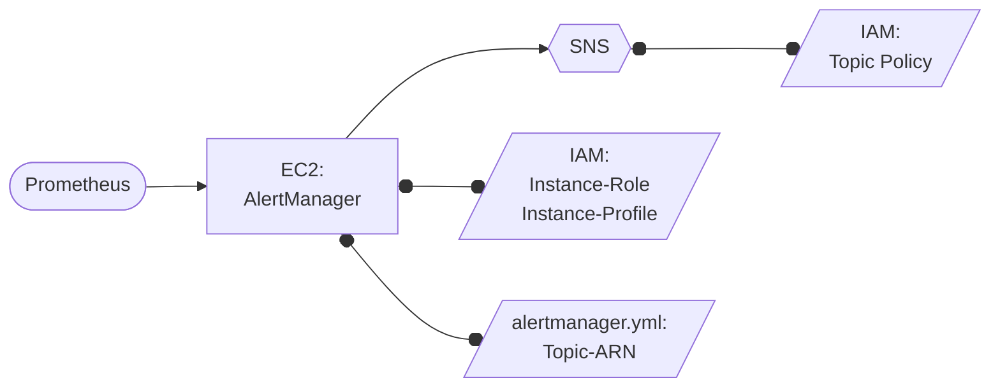

# Ü133 - Alerting

Martin | 10.11.2023

Wir wollen den heutigen Tag nutzen, um auf der Übung von gestern weiter aufzubauen. Dabei schauen wir uns Prometheus und Grafana genauer an. Zusätzlich werden wir uns mit dem Thema Alerting beschäftigen und wie man diese Komponente durch den Alertmanager bei uns integrieren kann.

## Projektziel

Die (eigene) Lösung von gestern (Übung 132) weiter ausbauen und den Alertmanager von Prometheus integrieren. Das System konfigurieren und testen, sodass Prometheus einen Alarm an den Alertmanager schickt.

### Aufgabe 0: ggfs. Umbauen/adaptieren

Falls du gestern nicht so weit gekommen bist, nimm die Musterlösung von hier und führe diesen Schritt mit aus: <https://github.com/MTeeeee/teaching/tree/main/Monitoring/Grafana_Prometheus>

Baue die Musterlösung so um, dass die Infrastruktur mit Terraform deployed werden kann und deploye sie dann auch in deiner Sandbox.
Schau dich im Ordner Ansible um und erstelle ggfs. fehlende Dateien (wie das inventory). Stelle sicher, dass die Playbooks laufen und alles deployed ist.

### Aufgabe 1: Installiere den Alertmanager

Erweitere deine Ansible Rollen um eine, die den *Alertmanager* auf dem gleichen Host wie Prometheus installiert. Führe die Schritte ggfs. zuerst manuell aus, damit du genau weißt was zu tun ist.
Am Ende soll der Alertmanager laufen und ebenfalls von außen übers Internet erreichbar sein. Der *Standard-Port* ist *9093*, vergiss nicht diesen in AWS freizuschalten.

Hilfreiche Links:

- <https://github.com/prometheus/alertmanager>

### Aufgabe 2: Konfiguration

Als nächstes muss Prometheus konfiguriert werden. Eine minimale Konfigurationsdatei solltest du unter `/etc/prometheus/prometheus.yml` vorfinden.
Stelle sicher, dass der Alertmanager unter Sektion `alerting` bekannt gemacht wird. Fülle dafür die Lücken in der Konfigurationsdatei.

Hilfreiche Links:

- <https://prometheus.io/docs/prometheus/latest/configuration/configuration/>
- <https://github.com/prometheus/prometheus/blob/main/documentation/examples/prometheus.yml>

### Aufgabe 3: Alerts

Schreibe eine Konfigurationsdatei mit Alertdefinitionen und stelle sicher, dass Prometheus die Alerts kennt und darauf reagieren kann. Auf der Prometheus Web Oberfläche unter dem Menüpunkt ‘Alerts’ sollten dann die Alertdefinitionen zu sehen sein.

Hilfreiche Links:

- <https://prometheus.io/docs/prometheus/latest/configuration/alerting_rules/#templating>

### Aufgabe 4: Testen

Teste das Alerting System, indem du einen Alert erzwingst. Das kommt jetzt auf deine Alert Rules an, die du konfiguriert hast.
Der simpelste Alert ist ‘InstanceDown’ (siehe unten). Dieser wird ausgelöst, wenn ein node_exporter auf einem Host nicht mehr abgefragt werden kann. Erzwinge einen Alarm, indem du bspw. den node_exporter auf der anderen EC2 Instanz abschaltest.

In Prometheus sollte unter Alerting die entsprechende Zeile gelb bzw. rot eingefärbt sein und (1 active) stehen haben.

Wenn nun alles korrekt eingestellt ist, hat der Alertmanager den Alarm erhalten. Das kann nachgeschaut werden, indem man die Weboberfläche des Alertmanager aufruft.

### Aufgabe 5: Grafana integration

Logge dich in der laufenden Grafana Instanz ein. Füge nun Prometheus als Datenquelle hinzu. Stöbere in den öffentlichen Dashboards und importiere das Dashboard ‘Node Exporter Full’ in deine Grafana Instanz. <https://grafana.com/grafana/dashboards/>

Hilfreiche Links:

- <https://prometheus.io/docs/visualization/grafana/>

## AWS-SNS-Anbindung

### Struktur

Aufbauend auf der Terraform-Struktur der Übung 133 soll eine Anbindung an AWS SNS für das Alerting erfolgen.

