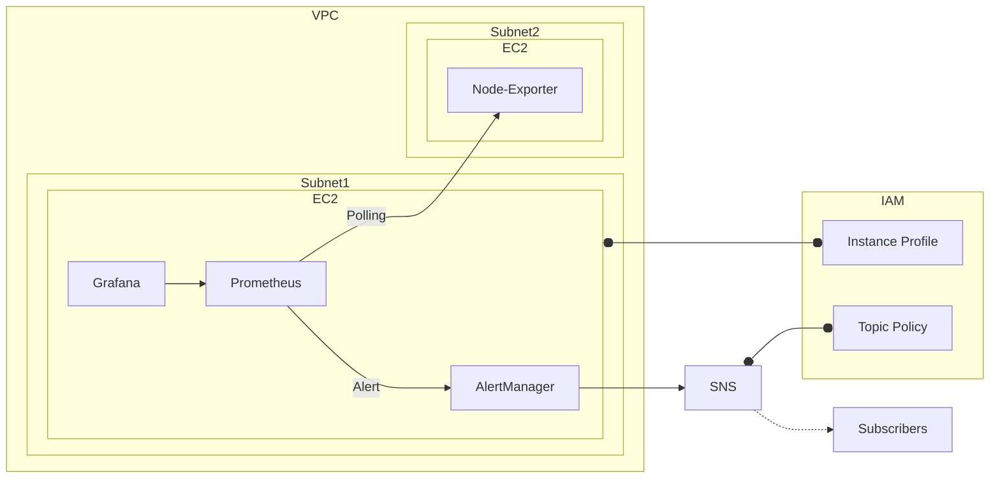

# Infrastruktur

```mermaid
flowchart LR
    subgraph VPC
    direction TB
        subgraph Subnet1
        direction TB
            subgraph EC2
            direction TB
                Prom[Prometheus]
                Grafana
                AM[AlertManager]
                Grafana --> Prom
            end
        end

        subgraph Subnet2
        direction TB
            subgraph ECne[EC2]
                NE[Node-Exporter]
            end
        end
    end
        
    subgraph IAM
        IAM1[Instance Profile]
        IAM2[Topic Policy]
    end

    Prom --Polling--> NE
    EC2 o--o IAM1
    SNS o--o IAM2
    Prom --Alert-->AM
    AM --> SNS
    SNS -.-> Subscribers

```
